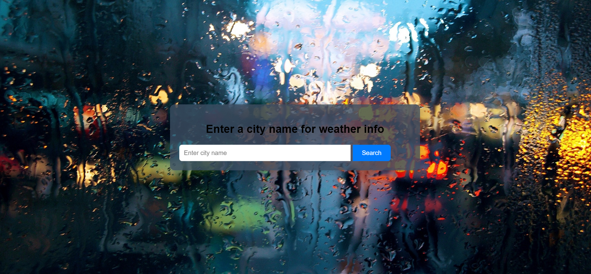
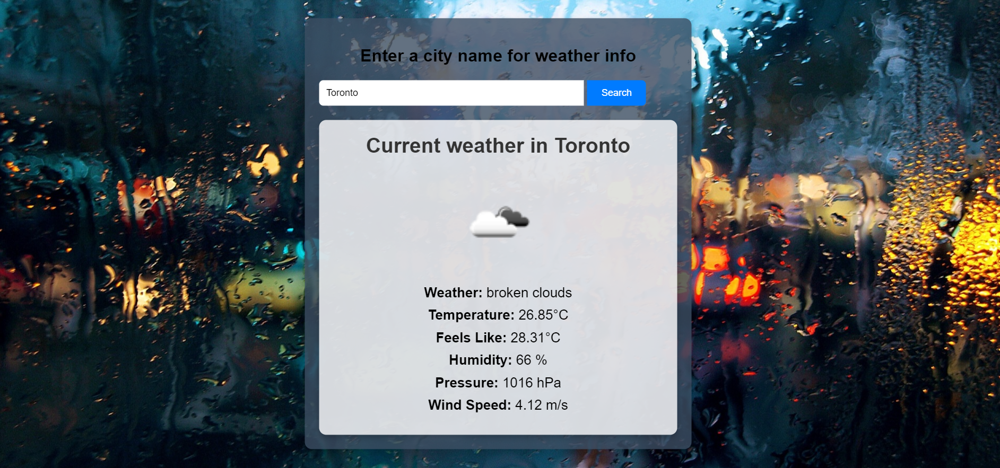

# Weather App API README

## Description

The Weather App is a simple web application that allows users to retrieve current weather information for a specific city. It utilizes the OpenWeatherMap API to fetch weather data and display it on the webpage.

## Table of Contents

- [How to Use](#how-to-use)
- [Screenshots](#screenshots)
- [Code Explanation](#code-explanation)
- [API Key](#api-key)
- [Customization](#customization)
- [Notes](#notes)
- [Contributing](#contributing)
- [License](#license)

## How to Use

1. Open the `index.html` file in a web browser.
2. Enter the name of a city in the input field.
3. Click the "Search" button to fetch and display the weather information for the entered city.

## Screenshots

### Search Page

### Result Page

## Code Explanation

- The HTML file `index.html` contains the structure of the webpage, including an input field for the city name and a button to initiate the search. The fetched weather information is displayed in the `weather-info` container.

- The JavaScript file `script.js` includes the logic to interact with the API and display the weather data on the webpage.

- The app fetches weather data using the OpenWeatherMap API. Replace the `apiKey` variable in the code with your own API key.

- The `fetchWeatherData` function retrieves weather data for the entered city. It handles cases where the city is not found or when an error occurs during the fetch.

- The `renderWeatherData` function populates the webpage with weather information, including temperature, humidity, pressure, wind speed, and a weather icon.

- The `capitalize` function is used to format the city name with a capitalized first letter.

## API Key

To use the Weather App, you need an API key from [OpenWeatherMap](https://openweathermap.org/api). Replace the `apiKey` variable in the code with your API key.

## Customization

Feel free to customize the styling by modifying the `style.css` file to match your preferences.

## Notes

This project serves as a basic example of using APIs to retrieve and display weather data on a webpage. It can be extended with additional features and improved error handling.

## Contributing

Contributions are welcome! Please fork the repository and create a pull request.

## License

This project is licensed under the [MIT License](LICENSE).
